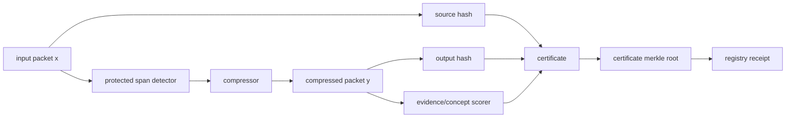
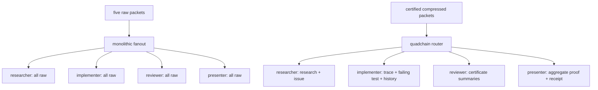
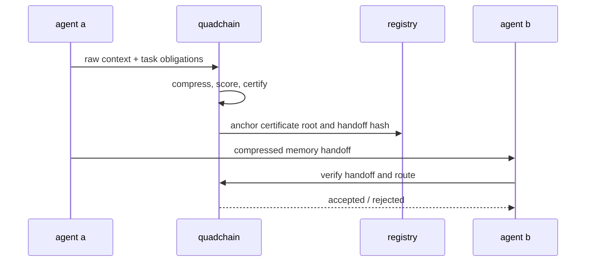

# quadchain: proof-carrying context compression and verifiable memory routing for multiagent llm systems

**authors:** andrew liu, madison zhan, silas wu, stephen hung

## abstract

modern agent systems do not just need shorter prompts; they need compressed memory that can be trusted, routed, audited, and rejected when unsafe. we introduce quadchain, a proof-carrying context compression architecture for multiagent llm systems. quadchain couples extractive compression with explicit evidence obligations, answer-concept preservation, role-aware routing, omission manifests, merkle-style commitments, and tamper-evident handoff validation. this reframes compression as a control plane: the output is not a summary, but a verifiable memory object that tells downstream agents what was preserved, what was deleted, and why the handoff is safe to use. on a coding-agent benchmark, quadchain compresses 2,250 input tokens to 1,383, preserving 41/41 required evidence and 38/38 answer concepts. in the 4-agent workflow eval, routing reduces total sent context from 9,000 to 2,283 tokens while preserving all measured obligations. in the actual 1k-300k scale ladder, quadchain measures 24 concrete role prompts, preserves 144/144 audited payload evidence checks, and saves 1,253,400 workflow tokens (67.43%). the frontier harness adds 2,880 paired benchmark rows across 20 cases, 12 methods, four budgets, and three seeds; receiver task eval saves 74.22% workflow tokens while matching or exceeding raw role-task success in the deterministic suite. adversarial handoff and route attacks are rejected 4/4 times. these results support a stronger thesis: the next compression layer for agentic ai is verifiable compressed memory, not blind summarization.

## 1. introduction

prompt compression research shows that llm inputs often contain redundancy and can be shortened without proportional loss of quality. llmlingua uses coarse-to-fine compression and budget control; longllmlingua targets long-context settings and position bias; llmlingua-2 reframes compression as extractive token classification trained from distilled labels; selective context explores self-information as a context filtering signal. these systems primarily optimize the prompt delivered to a model.

agentic systems add a second problem. context is no longer consumed once. it is copied, transformed, summarized, routed, and handed between agents. a receiver agent may act on compressed memory produced by another agent. without verification, the receiver cannot distinguish a faithful compression from one that dropped a critical error, id, source path, constraint, or security warning.

quadchain treats compressed context as a verifiable artifact. every accepted packet carries four linked commitments: source, compression, proof, and anchor. the core design goal is to reduce tokens while preserving the facts required for downstream work and making unsafe compression detectable.

## 2. related work

llmlingua demonstrates that prompts can be compressed with budget-aware coarse-to-fine methods while preserving task utility. longllmlingua extends this line to long context, emphasizing key-information placement and lost-in-the-middle effects. llmlingua-2 argues that entropy can be a weak proxy for compression value and instead uses distilled labels for extractive token classification. selective context removes lower-information content to increase effective context capacity.

quadchain is complementary. it does not attempt to beat model-based compression methods on universal compression ratio. instead, it adds a verification and routing layer around compression: required evidence is explicit, preserved facts are measured, omitted ranges are declared, and multiagent receivers verify a handoff before trusting it.

on the agent trust side, erc-8004 proposes identity, reputation, and validation registries for autonomous agents, and erc-8126 defines verification interfaces for registered agents. tee and zk-style verification work points toward independent attestations of agent execution. quadchain maps those ideas onto compressed memory: the registry anchor is not raw context, but a validation commitment to a compression certificate.

## 3. method

quadchain represents each compressed packet as:

- source commitment: input hash and packet metadata.
- compression commitment: output hash, token delta, compression ratio, and omission ranges.
- proof commitment: required evidence, answer concepts, missing items, and answer-readiness score.
- anchor commitment: merkle root, handoff hash, verifier version hash, and registry receipt.



### 3.1 compression policy

the current implementation is intentionally extractive and deterministic. it protects code-like spans, paths, ids, errors, dates, urls, key/value facts, and declared evidence. low-signal lines such as repeated debug output, verbose chatter, and redundant logs are candidates for deletion. role policies allow tool output to compress more aggressively than system or user intent.

### 3.2 answer-readiness objective

we score compressed packets by exact preservation of required evidence and answer concepts:

```text
answer_readiness = 0.65 * evidence_preservation + 0.35 * answer_concept_preservation
```

this metric is narrow but reproducible. it avoids relying on an external llm judge during the hackathon and directly tests whether the compressed context still contains the facts needed for downstream answers.

### 3.3 multiagent routing

the workflow eval compares two strategies:

- monolithic baseline: every agent receives every raw packet.
- quadchain routing: each role receives relevant compressed packets, certificate summaries, or aggregate proof material.



### 3.4 handoff verification

a receiver rejects a handoff if hashes, roots, verifier versions, registry commitments, required evidence, answer concepts, or route obligations fail. raw context and evidence strings remain off-chain; only hashes and validation metadata are anchored.



## 4. experimental setup

the evaluation uses five realistic coding-agent packets: an agent trace, failing test log, long agent history, noisy issue report, and research notes. each packet has declared required evidence and answer concepts. baselines compress to the same output-token budgets using head truncation, middle truncation, tail truncation, even-line sampling, and deterministic random-line deletion.

the full package also includes large-context stress testing, syntax-aware code compression checks, adversarial fragile-fact fixtures, learned-policy label evaluation, proof-certificate validation, a frontier benchmark harness, and a comprehensive deterministic test suite.

### 4.1 frontier benchmark harness

the upgraded methodology emits one row per `(dataset, item, method, budget, seed)`. the current run has 2,880 rows across 20 cases and 12 methods. methods include raw context, quadchain, head/middle/tail truncation, random deletion, keyword retrieval, embedding-top-k proxy, summary proxy, protected-span extraction, llmlingua-2 proxy, and selective-context proxy. budgets are 10%, 25%, 50%, and quadchain-native, each repeated over three seeds.

the dataset adapters are `longbench_style_qa`, `needle_in_haystack_style`, `ruler_style_multihop`, `token_diet_local_fixture`. the nonlocal adapters are public-benchmark-style local slices inspired by needle-in-haystack, ruler, and longbench-style tasks; they are explicitly labeled as adapters, not full external benchmark runs. this lets the system test methodology now without overclaiming public leaderboard results.

## 5. results

### 5.1 single-context compression

| input tokens | output tokens | saved | reduction | evidence | answer concepts | answer-readiness |
| ---: | ---: | ---: | ---: | ---: | ---: | ---: |
| 2,250 | 1,383 | 867 | 38.53% | 41/41 | 38/38 | 1.000 |

### 5.2 baselines


| system | evidence | concepts | failure rows |
| --- | ---: | ---: | ---: |
| quadchain / token diet | 41/41 | 38/38 | 0 |
| best same-budget naive per packet | 41/41 | 36/38 | 20/25 naive rows fail evidence or concepts |

the stronger five-baseline set makes the comparison more honest: some naive routes preserve all evidence on easy packets, but the best aggregate naive strategy still loses answer concepts.

### 5.3 multiagent workflow


| workflow | raw tokens | routed tokens | saved | reduction | evidence | concepts |
| --- | ---: | ---: | ---: | ---: | ---: | ---: |
| 4-agent monolithic vs quadchain | 9,000 | 2,283 | 6,717 | 74.63% | 41/41 | 38/38 |

### 5.4 adversarial safety

| attack | expected | result |
| --- | --- | --- |
| tampered merkle root | rejected | rejected |
| dropped required evidence | rejected | rejected |
| stale registry receipt | rejected | rejected |
| invalid route missing role-critical packet | rejected | rejected |

### 5.5 measured large context

| setting | raw context | compressed context | saved | reduction | evidence |
| --- | ---: | ---: | ---: | ---: | ---: |
| 115k-token context compression | 115,038 | 74,813 | 40,225 | 34.97% | 12/12 |

### 5.6 actual scale ladder


| magnitudes | role prompts | smallest input | largest input | raw prompts | quadchain prompts | saved | reduction | evidence |
| ---: | ---: | ---: | ---: | ---: | ---: | ---: | ---: | ---: |
| 6 | 24 | 1,126 | 313,554 | 1,858,850 | 605,450 | 1,253,400 | 67.43% | 36/36 |

| target | input | compressed | raw role prompts | quadchain role prompts | saved | reduction |
| ---: | ---: | ---: | ---: | ---: | ---: | ---: |
| 1,000 | 1,126 | 765 | 4,659 | 2,127 | 2,532 | 54.35% |
| 3,000 | 3,203 | 2,122 | 12,967 | 4,849 | 8,118 | 62.61% |
| 10,000 | 10,534 | 6,909 | 42,291 | 14,419 | 27,872 | 65.91% |
| 30,000 | 31,431 | 20,558 | 125,879 | 41,733 | 84,146 | 66.85% |
| 100,000 | 104,632 | 68,030 | 418,683 | 136,664 | 282,019 | 67.36% |
| 300,000 | 313,554 | 202,527 | 1,254,371 | 405,658 | 848,713 | 67.66% |

### 5.7 frontier benchmark harness

| metric | value |
| --- | ---: |
| paired rows | 2,880 |
| eval cases | 20 |
| methods | 12 |
| quadchain mean task score | 0.6350 |
| quadchain ci95 | [0.5987, 0.6782] |
| quadchain mean token reduction | 57.85% |
| role payload evidence audit | 144/144 |
| obligation leakage delta | 0 |
| receiver raw task success | 50.0% |
| receiver quadchain task success | 75.0% |
| receiver workflow token reduction | 74.22% |

paired comparison deltas are reported against every baseline in `outputs/quadchain-benchmark-report.md`. the result is intentionally mixed: quadchain beats naive truncation and random deletion on the deterministic task score, while retrieval-style baselines can outperform it on some public-style retrieval adapters. that is a feature of the methodology, not a bug: it shows where quadchain is a trust and routing layer, not a universal retrieval replacement.

### 5.8 test suite

the comprehensive suite passes 46/46 checks when generated after all artifacts are present. covered categories include compression quality, baselines, multiagent/chain verification, scale/syntax behavior, docs, dashboard links, and bundle completeness.

## 6. discussion

quadchain is strongest when context contains a mix of exact facts and low-signal noise. it is especially useful for coding agents because important details often look small: file paths, line numbers, error names, request ids, cookie attributes, dates, and one-line constraints. those details should be protected, not summarized away.

the multiagent result is the main systems insight. a single compressed prompt saves once. a routed proof bundle saves across every agent that would otherwise receive duplicate context. certificate summaries and aggregate receipts give reviewer and presenter agents enough trust surface without replaying all source context.

## 7. limitations

- current public-style adapters are local deterministic slices, not full external longbench, ruler, needle-in-haystack, swe-bench, or gaia runs.
- local fixture obligations are hand-authored, though the frontier harness now separates local fixtures from public-style adapters.
- exact evidence matching is reproducible but narrower than semantic task success.
- on-chain anchoring is simulated locally; the solidity artifact is a proof-of-design, not deployed infrastructure.
- the local compressor is deterministic and conservative; model-based compression could improve ratios.
- the scale ladder uses synthetic traces, but the compression, role handoff prompts, token counts, and evidence checks are actually executed for every magnitude.

## 8. future work

- replace or augment the local compressor with a learned keep/delete model trained on the generated policy dataset.
- run llm-as-judge and task-execution evals when api keys are available.
- add erc-8004-style validation ids and optional tee/zktls attestation hashes to the registry contract.
- replace local public-style adapters with full public long-context and coding-agent datasets.
- support receiver-side selective rehydration when a route fails.

## 9. conclusion

quadchain reframes context compression as a verifiable systems primitive. the useful unit is not a shorter string; it is a compressed memory object with obligations, hashes, omission ranges, routing policy, and independent verification. this lets multiagent systems spend fewer tokens without blindly trusting compressed memory.

## references

1. llmlingua: compressing prompts for accelerated inference of large language models. [https://arxiv.org/abs/2310.05736](https://arxiv.org/abs/2310.05736). coarse-to-fine prompt compression with budget control and token-level compression.
2. longllmlingua: accelerating and enhancing llms in long context scenarios via prompt compression. [https://arxiv.org/abs/2310.06839](https://arxiv.org/abs/2310.06839). connects long-context compression with position bias and lost-in-the-middle effects.
3. llmlingua-2: data distillation for efficient and faithful task-agnostic prompt compression. [https://arxiv.org/abs/2403.12968](https://arxiv.org/abs/2403.12968). frames prompt compression as extractive token classification trained from distilled labels.
4. selective context for llms. [https://github.com/liyucheng09/Selective_Context](https://github.com/liyucheng09/Selective_Context). uses self-information to remove lower-value context and increase effective context capacity.
5. prompt compression for large language models: a survey. [https://aclanthology.org/2025.naacl-long.368.pdf](https://aclanthology.org/2025.naacl-long.368.pdf). surveys hard and soft prompt compression techniques.
6. erc-8004: trustless agents. [https://eips.ethereum.org/EIPS/eip-8004](https://eips.ethereum.org/EIPS/eip-8004). defines agent identity, reputation, and validation registries.
7. erc-8126: ai agent verification. [https://eips.ethereum.org/EIPS/eip-8126](https://eips.ethereum.org/EIPS/eip-8126). defines a verification interface for agents registered via erc-8004.
8. tees for ai agents: verifiable compute. [https://eco.com/support/en/articles/14796365-tees-for-ai-agents-verifiable-compute](https://eco.com/support/en/articles/14796365-tees-for-ai-agents-verifiable-compute). describes tee-based attested inference flows and their practical limitations.
