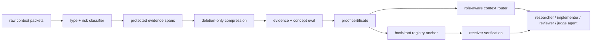
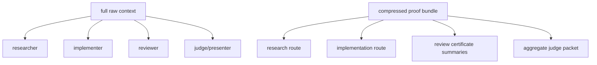
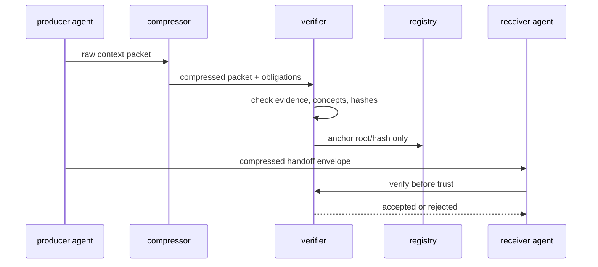

# quadchain: proof-carrying context compression for multiagent ai

**authors:** andrew liu, madison zhan, silas wu, stephen hung

## executive summary

quadchain is a compression system for llm and multiagent context. it reduces tokens by deleting low-signal context, routing only role-relevant compressed packets to each agent, and attaching proof certificates that let the receiver verify whether the compressed memory is safe to trust.

the key claim is not that every task can be compressed by a universal percentage. the claim is narrower and stronger: for coding-agent context, exact downstream evidence can be protected, measured, routed, and audited. on the current benchmark, quadchain compresses 2,250 tokens to 1,383, saves 867 tokens, preserves 41/41 evidence and 38/38 answer concepts, and keeps answer-readiness at 1.000.

for multiagent workflows, the win compounds. the measured 4-agent routing eval drops a monolithic 9,000-token workflow to 2,283 routed tokens, saving 6,717 tokens (74.63%) while preserving 41/41 evidence. unsafe handoff or route mutations are rejected 4/4 times.

the upgraded research harness adds a harder methodology layer: 2,880 paired rows across 20 eval cases, 12 methods, four token budgets, and three seeds. it separates payload evidence from injected obligations, verifies 144/144 role-packet payload evidence, and measures executable receiver tasks with 74.22% workflow token reduction.

## architecture

quadchain has four chains:

- source chain: input hashes, packet ids, and source ranges.
- compression chain: compressed output hashes, token deltas, and omission ranges.
- proof chain: required evidence, answer concepts, answer-readiness, and verifier results.
- anchor chain: merkle roots and registry receipts that make handoffs tamper-evident while keeping raw context off-chain.

## why this matters

single-call compression saves prompt tokens. multiagent compression saves workflow tokens. without routing, every agent receives the same full memory. with quadchain, each agent receives the subset it needs plus enough proof material to reject unsafe memory.

## measured results

| eval | raw tokens | quadchain tokens | saved | reduction | evidence | concepts | safety |
| --- | ---: | ---: | ---: | ---: | ---: | ---: | --- |
| single-context compression | 2,250 | 1,383 | 867 | 38.53% | 41/41 | 38/38 | answer-ready 1.000 |
| 4-agent workflow | 9,000 | 2,283 | 6,717 | 74.63% | 41/41 | 38/38 | route proof |
| measured large-context compression | 115,038 | 74,813 | 40,225 | 34.97% | 12/12 | n/a | off-chain raw context |
| scale ladder actual role prompts | 1,858,850 | 605,450 | 1,253,400 | 67.43% | 36/36 | n/a | 24 measured prompts |
| frontier benchmark harness | n/a | budget matched | n/a | 57.85% mean | 144/144 | task score 0.6350 | 2,880 paired rows |

## frontier benchmark methodology

the benchmark harness is designed to make the research claim harder to fake. each row is keyed by dataset adapter, item id, method, budget, seed, and scorer. the current offline run covers four adapters: `longbench_style_qa`, `needle_in_haystack_style`, `ruler_style_multihop`, `token_diet_local_fixture`. these include local fixtures plus needle-style retrieval, ruler-style multihop, and longbench-style qa adapters. they are public-benchmark-inspired local slices, not claims that the full external public datasets were downloaded and run.

| surface | result | why it matters |
| --- | ---: | --- |
| paired rows | 2,880 | compares methods under the same item, budget, and seed |
| methods | 12 | includes raw, quadchain, truncation, retrieval, summary, protected-span, and proxy learned baselines |
| role payload audit | 144/144 | required evidence text cannot satisfy itself |
| receiver task success | raw 50.0%, quadchain 75.0% | receiving agents must complete role-specific tasks |
| receiver workflow savings | 74.22% | multiagent routing saves context repeatedly |

this is the bridge from hackathon demo to research program: the same harness can later swap local adapters for full longbench, ruler, swe-bench verified, gaia, or live llm solver runs while preserving the same row schema and paired statistical comparisons.

## verification model

the receiver should never trust a compressed summary just because another agent produced it. it should verify:

- every certificate hash is included in the merkle root.
- compressed packets preserve required evidence and answer concepts.
- answer-readiness stays at the accepted threshold.
- omission ranges are declared.
- the registry receipt commits to the same handoff hash.
- raw context is not placed on-chain.

## threat model

| threat | failure mode | quadchain response |
| --- | --- | --- |
| blind truncation | drops middle or tail facts | same-budget baseline eval exposes missing evidence/concepts |
| unsafe compression | deletes exact ids, paths, errors, dates | protected spans and answer-readiness gate |
| malicious producer | alters compressed memory after certification | certificate hashes and merkle root mismatch |
| stale receipt | reuses old registry proof | handoff hash mismatch |
| over-sharing on-chain | leaks raw context or evidence strings | only hashes, roots, and validation metadata are anchored |
| invalid route | omits role-critical packets | route validation rejects missing obligations |

## implementation status

- deterministic local compressor and cli.
- batch runner and budget router.
- proof certificate generator with omission ranges.
- multiagent handoff verifier with adversarial cases.
- frontier benchmark harness with 2,880 paired rows, role evidence audit, receiver task eval, and bootstrap confidence intervals.
- quadchain eval report and machine-readable json.
- comprehensive test suite: 46/46 checks passing when generated.
- submission bundle includes scripts, fixtures, docs, reports, and verification command.

## limits

quadchain is not a claim that this exact local compressor is state of the art. llmlingua, longllmlingua, llmlingua-2, and selective context explore stronger model-based compression families. the contribution here is the proof-carrying control plane: evidence obligations, role routing, tamper-evident memory handoffs, deterministic judge-ready evals for coding-agent context, and a benchmark harness that can scale into full public benchmark runs.

## references

1. llmlingua: compressing prompts for accelerated inference of large language models. [https://arxiv.org/abs/2310.05736](https://arxiv.org/abs/2310.05736). coarse-to-fine prompt compression with budget control and token-level compression.
2. longllmlingua: accelerating and enhancing llms in long context scenarios via prompt compression. [https://arxiv.org/abs/2310.06839](https://arxiv.org/abs/2310.06839). connects long-context compression with position bias and lost-in-the-middle effects.
3. llmlingua-2: data distillation for efficient and faithful task-agnostic prompt compression. [https://arxiv.org/abs/2403.12968](https://arxiv.org/abs/2403.12968). frames prompt compression as extractive token classification trained from distilled labels.
4. selective context for llms. [https://github.com/liyucheng09/Selective_Context](https://github.com/liyucheng09/Selective_Context). uses self-information to remove lower-value context and increase effective context capacity.
5. prompt compression for large language models: a survey. [https://aclanthology.org/2025.naacl-long.368.pdf](https://aclanthology.org/2025.naacl-long.368.pdf). surveys hard and soft prompt compression techniques.
6. erc-8004: trustless agents. [https://eips.ethereum.org/EIPS/eip-8004](https://eips.ethereum.org/EIPS/eip-8004). defines agent identity, reputation, and validation registries.
7. erc-8126: ai agent verification. [https://eips.ethereum.org/EIPS/eip-8126](https://eips.ethereum.org/EIPS/eip-8126). defines a verification interface for agents registered via erc-8004.
8. tees for ai agents: verifiable compute. [https://eco.com/support/en/articles/14796365-tees-for-ai-agents-verifiable-compute](https://eco.com/support/en/articles/14796365-tees-for-ai-agents-verifiable-compute). describes tee-based attested inference flows and their practical limitations.
